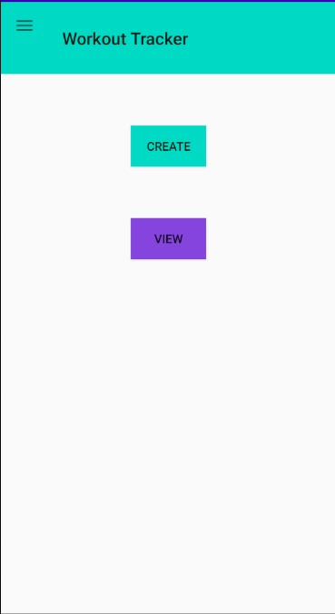
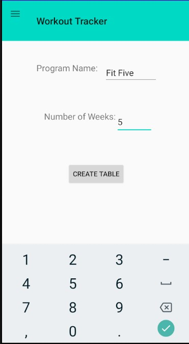
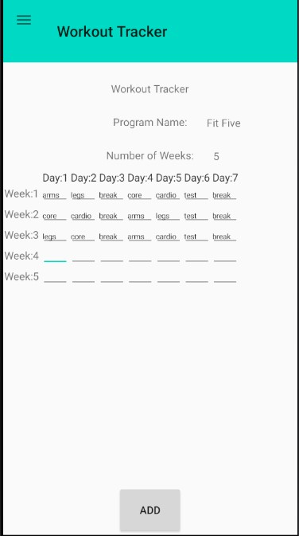
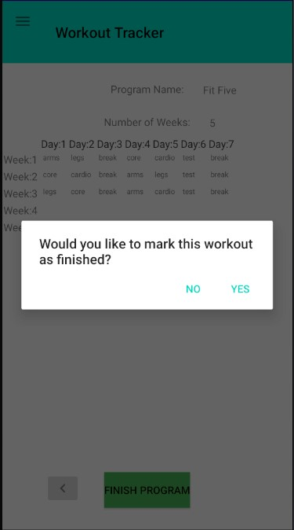
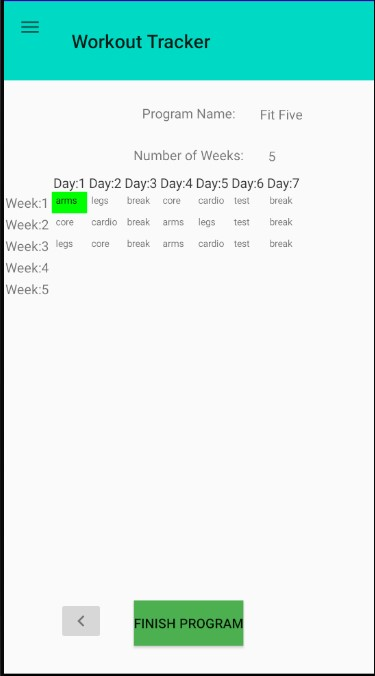

# WorkoutTracker
Simple Android app to track workouts via a weekly schedule.
Data is stored using AWS DynamoDB via the API Gateway.

## Setup
Since the app relies on AWS DynamoDB and Lambda using API Gateway the tables and fucntions will need to be setup first.
After creating an AWS account you can create the two tables described in [schema.txt](aws/schema.txt).

Then create three Lambda functions: addWorkout, deleteWorkout, and finish using the files in [aws/lambda](aws/lambda).
With the functions set up you can connect them to an API endpoint which will be used in [DB.java](app/src/main/java/com/example/myapplication/DB.java)

Additionally, an identity pool is needed to provide credentials for the app(instructions can be found [here](https://docs.aws.amazon.com/cognito/latest/developerguide/identity-pools.html))

After filling in the API and Identity pool ID in DB.java the app is ready to run on an emulator or device.

## Demo 
On startup, the app will display a home page with buttons linking to the main options: View and Create.

Workout programs are created by name and number of weeks which are used to initialize a fragment for filling in each workout.

After the days are filled in the program can be added and viewed along with the others in the View menu.

After a workout is finished it can be marked off and pressing the finish program button will delete it. 

  